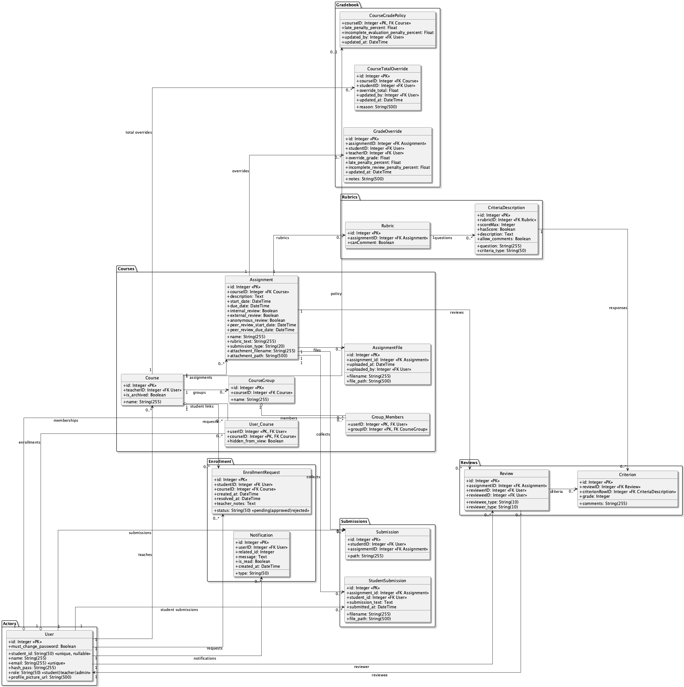

# Database Schema — Peer Evaluation App

This document captures the relational schema implemented by the Flask backend (SQLAlchemy). The authoritative source of truth is the SQLAlchemy models in `flask_backend/api/models`.

## Source of Truth

- **Models:** `flask_backend/api/models/*.py` — authoritative field list, constraints, and cascades
- **DDL reference:** `docs/schema/schema.sql` — legacy SQL schema kept for reference
- **Diagram:** `docs/schema/database-schema.puml` renders to `database-schema.png`; regenerate after structural changes using the PlantUML CLI or the VS Code PlantUML extension

## Entity-Relationship Diagram

---

## Schema Overview

**18 models across 18 tables, ~95 columns total.**

### 1. Users & Authentication

#### User — `"User"`

| Column | Type | Constraints |
|--------|------|-------------|
| `id` | Integer | **PK**, auto-increment |
| `student_id` | String(50) | unique, nullable, indexed |
| `name` | String(255) | NOT NULL |
| `email` | String(255) | NOT NULL, unique, indexed |
| `hash_pass` | String(255) | NOT NULL |
| `role` | String(50) | NOT NULL, default `"student"`, CHECK IN (`student`, `teacher`, `admin`) |
| `must_change_password` | Boolean | NOT NULL, default `False` |
| `profile_picture_url` | String(500) | nullable |

**Relationships:** `teaching_courses`, `user_courses`, `courses` (via User_Courses), `submissions`, `reviews_made`, `reviews_received`, `group_memberships`, `enrollment_requests`, `notifications`

---

### 2. Courses & Enrollment

#### Course — `"Course"`

| Column | Type | Constraints |
|--------|------|-------------|
| `id` | Integer | **PK** |
| `teacherID` | Integer | **FK → User.id**, NOT NULL, indexed |
| `name` | String(255) | nullable |
| `is_archived` | Boolean | NOT NULL, default `False` |

**Relationships:** `teacher`, `assignments`, `user_courses`, `students` (via User_Courses), `groups`

#### User_Course — `"User_Courses"` (enrollment join table)

| Column | Type | Constraints |
|--------|------|-------------|
| `userID` | Integer | **PK**, **FK → User.id** |
| `courseID` | Integer | **PK**, **FK → Course.id** |
| `hidden_from_view` | Boolean | NOT NULL, default `False` |

#### EnrollmentRequest — `"EnrollmentRequest"`

| Column | Type | Constraints |
|--------|------|-------------|
| `id` | Integer | **PK** |
| `studentID` | Integer | **FK → User.id**, NOT NULL, indexed |
| `courseID` | Integer | **FK → Course.id**, NOT NULL, indexed |
| `status` | String(50) | NOT NULL, default `"pending"`, CHECK IN (`pending`, `approved`, `rejected`) |
| `created_at` | DateTime | NOT NULL, default `utcnow` |
| `resolved_at` | DateTime | nullable |
| `teacher_notes` | Text | nullable |

---

### 3. Assignments & Groups

#### Assignment — `"Assignment"`

| Column | Type | Constraints |
|--------|------|-------------|
| `id` | Integer | **PK** |
| `courseID` | Integer | **FK → Course.id**, indexed |
| `name` | String(255) | nullable |
| `rubric_text` | String(255) | nullable (DB column: `"rubric"`) |
| `description` | Text | nullable |
| `start_date` | DateTime(tz) | nullable, indexed |
| `due_date` | DateTime(tz) | nullable, indexed |
| `submission_type` | String(20) | NOT NULL, default `"individual"` |
| `internal_review` | Boolean | NOT NULL, default `False` |
| `external_review` | Boolean | NOT NULL, default `False` |
| `anonymous_review` | Boolean | NOT NULL, default `False` |
| `peer_review_start_date` | DateTime(tz) | nullable, indexed |
| `peer_review_due_date` | DateTime(tz) | nullable, indexed |
| `attachment_filename` | String(255) | nullable |
| `attachment_path` | String(500) | nullable |

**Relationships:** `course`, `rubrics`, `submissions`, `reviews`, `files`, `student_submissions`, `grade_overrides`

#### AssignmentFile — `"AssignmentFile"`

| Column | Type | Constraints |
|--------|------|-------------|
| `id` | Integer | **PK** |
| `assignment_id` | Integer | **FK → Assignment.id** (CASCADE), NOT NULL, indexed |
| `filename` | String(255) | NOT NULL |
| `file_path` | String(500) | NOT NULL |
| `uploaded_at` | DateTime(tz) | NOT NULL, default `utcnow` |
| `uploaded_by` | Integer | **FK → User.id**, NOT NULL |

#### CourseGroup — `"CourseGroup"`

| Column | Type | Constraints |
|--------|------|-------------|
| `id` | Integer | **PK** |
| `name` | String(255) | nullable |
| `courseID` | Integer | **FK → Course.id**, NOT NULL, indexed |

**Relationships:** `course`, `members`

#### Group_Members — `"Group_Members"` (composite PK join table)

| Column | Type | Constraints |
|--------|------|-------------|
| `userID` | Integer | **PK**, **FK → User.id** |
| `groupID` | Integer | **PK**, **FK → CourseGroup.id** |

---

### 4. Submissions

#### Submission — `"Submission"`

| Column | Type | Constraints |
|--------|------|-------------|
| `id` | Integer | **PK** |
| `path` | String(255) | nullable |
| `studentID` | Integer | **FK → User.id**, NOT NULL, indexed |
| `assignmentID` | Integer | **FK → Assignment.id**, NOT NULL, indexed |

**Relationships:** `student`, `assignment`

#### StudentSubmission — `"StudentSubmission"`

| Column | Type | Constraints |
|--------|------|-------------|
| `id` | Integer | **PK** |
| `assignment_id` | Integer | **FK → Assignment.id** (CASCADE), NOT NULL, indexed |
| `student_id` | Integer | **FK → User.id** (CASCADE), NOT NULL, indexed |
| `filename` | String(255) | nullable |
| `file_path` | String(500) | nullable |
| `submission_text` | Text | nullable |
| `submitted_at` | DateTime(tz) | NOT NULL, default `utcnow` |

**Relationships:** `assignment`, `student`

---

### 5. Reviews

#### Review — `"Review"`

| Column | Type | Constraints |
|--------|------|-------------|
| `id` | Integer | **PK** |
| `assignmentID` | Integer | **FK → Assignment.id**, NOT NULL, indexed |
| `reviewerID` | Integer | **FK → User.id**, NOT NULL, indexed |
| `revieweeID` | Integer | **FK → User.id**, NOT NULL, indexed |
| `reviewee_type` | String(10) | NOT NULL, default `"user"` |
| `reviewer_type` | String(10) | NOT NULL, default `"user"` |

**Relationships:** `assignment`, `reviewer`, `reviewee`, `criteria`

#### Criterion — `"Criterion"` (review responses)

| Column | Type | Constraints |
|--------|------|-------------|
| `id` | Integer | **PK** |
| `reviewID` | Integer | **FK → Review.id**, NOT NULL, indexed |
| `criterionRowID` | Integer | **FK → Criteria_Description.id**, NOT NULL, indexed |
| `grade` | Integer | nullable |
| `comments` | String(255) | nullable |

**Relationships:** `review`, `criterion_row`

---

### 6. Rubrics

#### Rubric — `"Rubric"`

| Column | Type | Constraints |
|--------|------|-------------|
| `id` | Integer | **PK** |
| `assignmentID` | Integer | **FK → Assignment.id**, NOT NULL, indexed |
| `canComment` | Boolean | NOT NULL, default `True` |

**Relationships:** `assignment`, `criteria_descriptions`

#### CriteriaDescription — `"Criteria_Description"` (rubric questions)

| Column | Type | Constraints |
|--------|------|-------------|
| `id` | Integer | **PK** |
| `rubricID` | Integer | **FK → Rubric.id**, NOT NULL, indexed |
| `question` | String(255) | nullable |
| `scoreMax` | Integer | nullable |
| `hasScore` | Boolean | NOT NULL, default `True` |
| `description` | Text | nullable |
| `criteria_type` | String(50) | NOT NULL, default `"both"` |
| `allow_comments` | Boolean | NOT NULL, default `False` |

**Relationships:** `rubric`, `criteria`

---

### 7. Gradebook

#### CourseGradePolicy — `"CourseGradePolicy"`

| Column | Type | Constraints |
|--------|------|-------------|
| `courseID` | Integer | **PK**, **FK → Course.id** |
| `late_penalty_percent` | Float | NOT NULL, default `0.0` |
| `incomplete_evaluation_penalty_percent` | Float | NOT NULL, default `0.0` |
| `updated_by` | Integer | **FK → User.id**, nullable |
| `updated_at` | DateTime | NOT NULL, default `utcnow`, auto-updates |

#### GradeOverride — `"GradeOverride"`

| Column | Type | Constraints |
|--------|------|-------------|
| `id` | Integer | **PK** |
| `assignmentID` | Integer | **FK → Assignment.id**, NOT NULL, indexed |
| `studentID` | Integer | **FK → User.id**, NOT NULL, indexed |
| `teacherID` | Integer | **FK → User.id**, NOT NULL, indexed |
| `override_grade` | Float | NOT NULL |
| `late_penalty_percent` | Float | NOT NULL, default `0.0` |
| `incomplete_review_penalty_percent` | Float | NOT NULL, default `0.0` |
| `notes` | String(500) | nullable |
| `updated_at` | DateTime | NOT NULL, default `utcnow`, auto-updates |

#### CourseTotalOverride — `"CourseTotalOverride"`

| Column | Type | Constraints |
|--------|------|-------------|
| `id` | Integer | **PK** |
| `courseID` | Integer | **FK → Course.id**, NOT NULL, indexed |
| `studentID` | Integer | **FK → User.id**, NOT NULL, indexed |
| `override_total` | Float | NOT NULL |
| `reason` | String(500) | nullable |
| `updated_by` | Integer | **FK → User.id**, NOT NULL |
| `updated_at` | DateTime | NOT NULL, default `utcnow`, auto-updates |

**Table constraint:** `UNIQUE(courseID, studentID)`

---

### 8. Notifications

#### Notification — `"Notification"`

| Column | Type | Constraints |
|--------|------|-------------|
| `id` | Integer | **PK** |
| `userID` | Integer | **FK → User.id**, NOT NULL, indexed |
| `type` | String(50) | NOT NULL |
| `related_id` | Integer | NOT NULL |
| `message` | Text | NOT NULL |
| `is_read` | Boolean | NOT NULL, default `False` |
| `created_at` | DateTime | NOT NULL, default `utcnow` |

**Relationships:** `user`

---

## Constraints and Defaults

- Auto-incrementing integer primary keys for all base tables except the two join tables (`User_Courses`, `Group_Members`), which use composite keys
- `User.email` is unique and indexed; `User.role` constrained to (`student`, `teacher`, `admin`)
- `Assignment.due_date` is nullable; when set, application logic blocks edits after the deadline
- `Rubric.canComment` and `CriteriaDescription.hasScore` both default to `True`
- `EnrollmentRequest.status` constrained to (`pending`, `approved`, `rejected`)
- Foreign keys are declared in SQLAlchemy and respected by SQLite/PostgreSQL

## Alignment With Code

- SQLAlchemy models live in `flask_backend/api/models` and mirror the tables above
- Route handlers under `flask_backend/api/controllers` operate on these models; see `docs/dev-guidelines/ENDPOINT_SUMMARY.md` for API-level interactions
- When adding or editing columns, update the SQLAlchemy models, regenerate the PlantUML diagram, and keep this document in sync
