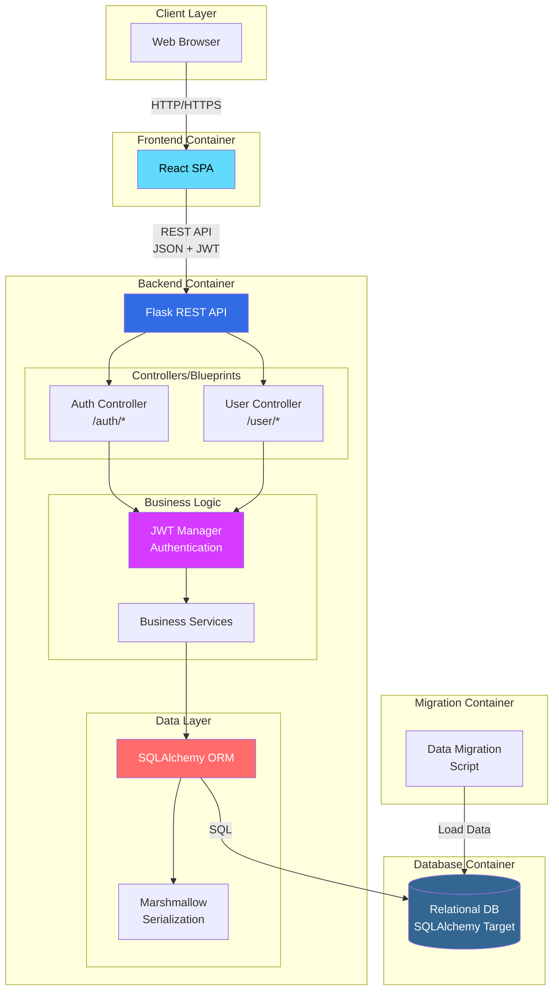

# Project Architecture

## Tech Stack Overview

### Backend

- **Language**: Python 3.x
- **Web Framework**: Flask (REST API)
- **ORM**: SQLAlchemy (Flask-SQLAlchemy)
- **Database**: Relational DB via SQLAlchemy (MySQL/MariaDB or PostgreSQL) — selected at deploy time
- **Authentication**: JWT (Flask-JWT-Extended)
- **Serialization**: Marshmallow (Flask-Marshmallow, Marshmallow-SQLAlchemy)
- **WSGI Server**: Gunicorn (production)
- **Testing**: pytest, pytest-pudb
- **Development Tools**: pudb, ipython

### Frontend

- **Framework**: React + TypeScript + Vite (containerized separately)
- **Architecture**: SPA (Single Page Application) consuming REST API
- **Dev Server**: Vite (HMR) on <http://localhost:3000>

### Infrastructure

- **Containerization**: Docker, Docker Compose
- **CI/CD**: GitHub Actions
- **Version Control**: Git, GitHub
- **Database Migration**: SQLAlchemy migrations (via Flask CLI / Flask-Migrate)

### Development Environment

- **Package Managers**: pip (backend), pnpm (frontend)
- **Virtual Environments**: venv
- **Database Client**: psycopg2-binary (PostgreSQL adapter)

---

## Project Architecture Diagram

The Peer Evaluation App follows a containerized microservices architecture with clear separation between frontend, backend, and data layers.

### Architecture Principles

**Separation of Concerns:**

- Frontend and backend are completely decoupled
- Backend is a pure JSON REST API (no HTML templates)
- Each service runs in its own container

**Stateless API:**

- JWT-based authentication (no server-side sessions)
- RESTful design with proper HTTP methods and status codes
- All endpoints return JSON responses

**Data Flow:**

1. Client sends HTTP request with JWT token (if authenticated)
2. Flask routes request to appropriate controller/blueprint
3. Controller validates JWT and permissions
4. Business logic processes the request
5. ORM queries database Can output to any type of database (just needs to be set in [backend](../../flask_backend/api/__init__.py))
6. Marshmallow serializes response (excludes sensitive fields)
7. JSON response returned to client

## Container Architecture

- **Backend**: Self-contained Flask app with all dependencies
- **Frontend**: React + TypeScript SPA (Vite) served separately
- **Database**: Relational DB (MySQL/MariaDB or PostgreSQL) with persistent volume
